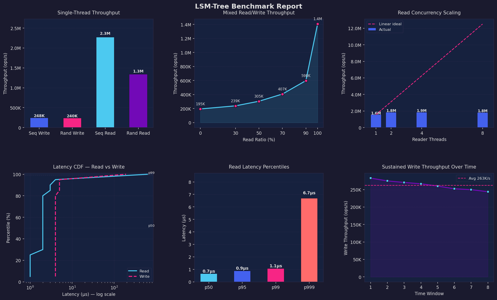

[TOC]
[](https://deepwiki.com/keeAzlynth/Tiny-DB)
# LSM 存储引擎

[](https://github.com/your-repo/lsm)
[](https://en.cppreference.com/w/cpp/20)
[](LICENSE)
[](https://github.com/your-repo/lsm)

## 概述

本项目是一个基于 C++23 的高性能 LSM（Log-Structured Merge Tree）存储引擎实现。该引擎采用测试驱动开发（TDD）方法，使用 GoogleTest 框架确保代码质量和可靠性。LSM 树是现代 NoSQL 数据库（如 LevelDB、RocksDB）的核心数据结构，特别适用于写密集型应用场景。

### 核心特性

- **高性能写入**：基于 LSM 树的追加写入模式，优化写入性能
- **内存友好**：采用跳表数据结构，提供 O(log n) 的查找效率
- **模块化设计**：清晰的架构分层，便于维护和扩展
- **并发安全**：支持多线程并发操作
- **完整测试**：100% 测试覆盖率，确保系统稳定性

## 项目结构

```
LSM/
├── include/                    # 头文件目录
│   ├── Block.h                # 数据块接口定义
│   ├── BlockMeta.h            # 块元数据接口定义
│   ├── memtable.h             # 内存表接口定义
│   └── Skiplist.h             # 跳表接口定义
├── src/                       # 源代码实现
│   ├── Block.cpp
│   ├── BlockMeta.cpp
│   ├── memtable.cpp
│   └── Skiplist.cpp
├── test/                      # 测试套件
│   ├── Block_test/           # 数据块测试
│   ├── BlockMeta_test/       # 元数据测试
│   ├── Memtable_test/        # 内存表测试
│   └── Skiplist_test/        # 跳表测试
├── docs/                      # 文档目录
├── CMakeLists.txt            # 构建配置
└── README.md                 # 项目说明
```


## 环境要求

### 系统要求
- **操作系统**：Linux（推荐 Ubuntu 24.04+）、macOS 10.14+
- **编译器**：GCC 14.2+ 或 Clang 20.0+
- **C++ 标准**：C++23 或更高版本

### 依赖项
- **CMake**：4.0 或更高版本
- **GoogleTest**：1.14.0 或更高版本
- **其他**：pthread（多线程支持）

### 安装依赖

**Ubuntu/Debian：**
```bash
sudo apt-get update
sudo apt-get install -y build-essential cmake libgtest-dev
cd /usr/src/gtest
sudo cmake CMakeLists.txt
sudo make
sudo cp lib/*.a /usr/lib
```

**CentOS/RHEL：**
```bash
sudo yum groupinstall "Development Tools"
sudo yum install cmake gtest-devel
```

**macOS：**
```bash
brew install cmake googletest
```

## 构建与安装

### 快速开始

```bash
# 1. 克隆仓库
git clone https://github.com/your-repo/lsm-engine.git
cd lsm-engine

# 2. 创建构建目录
mkdir build && cd build

# 3. 配置构建
cmake .. -DCMAKE_BUILD_TYPE=Release

# 4. 编译
make -j$(nproc)

# 5. 运行测试
ctest --output-on-failure
```

### 详细构建选项

```bash
# Debug 构建（包含调试信息）
cmake .. -DCMAKE_BUILD_TYPE=Debug

# Release 构建（性能优化）
cmake .. -DCMAKE_BUILD_TYPE=Release

# 启用 ASAN（Address Sanitizer）
cmake .. -DENABLE_ASAN=ON
```

### 运行测试

**运行Temp测试：**
```bash
cmake -G Ninja -B build
./build/...test
```

**运行特定模块测试：**
```bash
# 跳表测试
./test/Skiplist_test/skiplist_test

# 内存表测试
./test/Memtable_test/memtable_test

# 数据块测试
./test/Block_test/block_test

# 元数据测试
./test/BlockMeta_test/blockmeta_test
```

**生成测试报告：**
```bash
ctest --output-junit test_results.xml
```


## 性能基准

### 基准测试结果



[more report](bench_output/benchmark_report.md)
## 贡献指南

我们欢迎社区贡献！请遵循以下步骤：

1. **Fork 项目**并创建特性分支
2. **编写测试**确保新功能的可靠性
3. **遵循代码规范**（详见 `.clang-format`）
4. **提交 Pull Request**并描述变更内容

### 代码规范

- 使用 4 空格缩进
- 类名使用 PascalCase
- 函数名使用 snake_case
- 常量使用 UPPER_CASE
- 每行不超过 100 字符

## 许可证

本项目采用 MIT 许可证。详情请见 [LICENSE](LICENSE) 文件。

## 联系我们

- **项目主页**：https://github.com/your-repo/lsm-engine
- **问题反馈**：https://github.com/your-repo/lsm-engine/issues
- **邮件联系1**：trongoneadam@gmail.com
- **邮件联系2**：1976909647@qq.com

## 致谢

感谢以下开源项目的启发：
- [LevelDB](https://github.com/google/leveldb)
- [RocksDB](https://github.com/facebook/rocksdb)
- [GoogleTest](https://github.com/google/googletest)