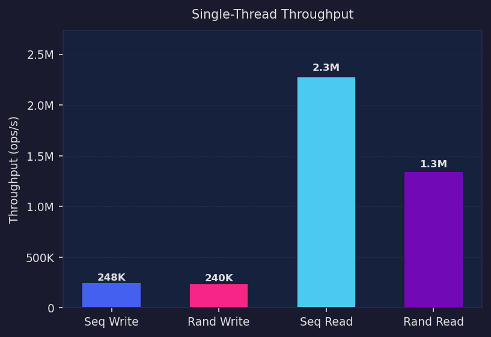
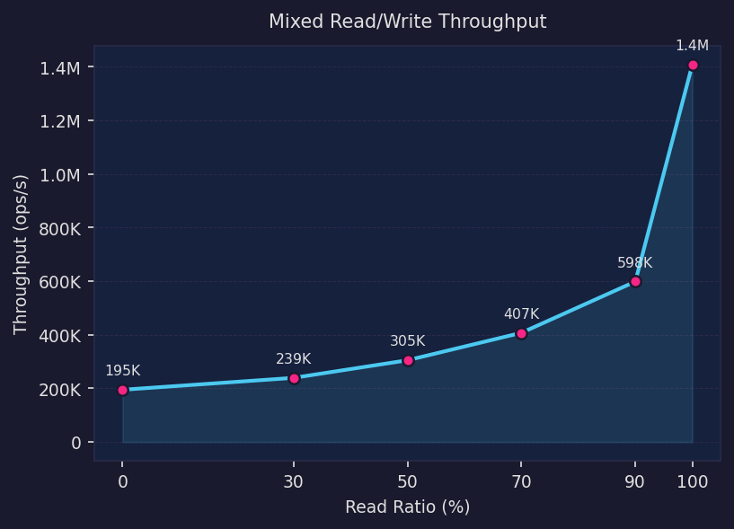
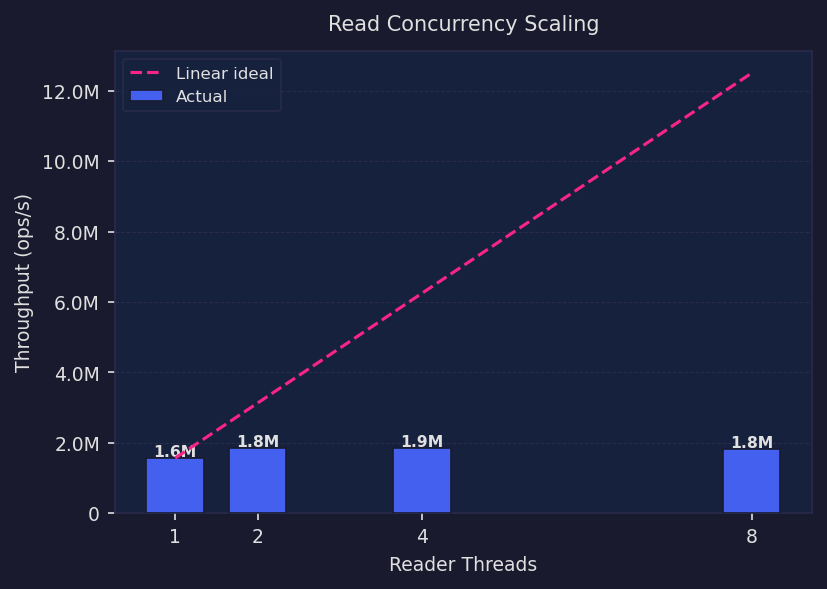
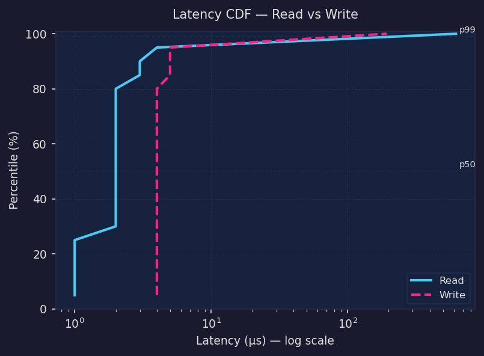
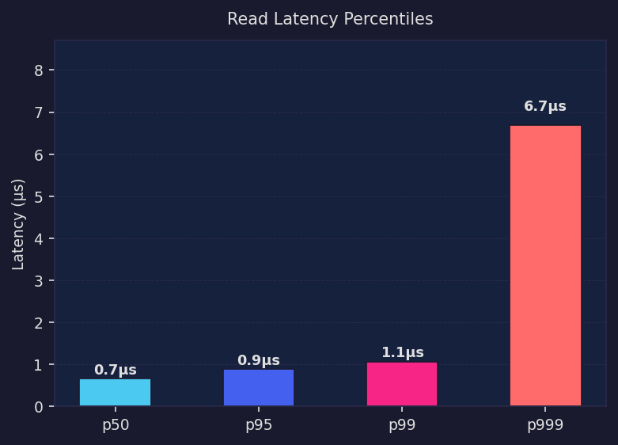
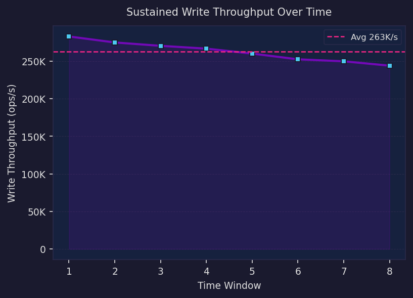

# LSM-Tree Benchmark Report

> **Generated:** 2026-04-20  
> **Engine:** Custom LSM-Tree (C++)  
> **Platform:** Linux x86-64  

---

## Overview

| Metric | Result |
|---|---|
| Sequential Write | `248K ops/s` |
| Random Write | `240K ops/s` |
| Sequential Read | `2.3M ops/s` |
| Random Read (single thread) | `1.3M ops/s` |
| Random Read (peak, 4 threads) | `1.9M ops/s` |
| Read Latency p50 / p99 / p999 | `0.7µs / 1.1µs / 6.7µs` |
| Sustained Write (avg over 8 windows) | `263K ops/s` |

---

## 1. Single-Thread Throughput

Sequential reads benefit from MemTable hot-path and block cache warmth.  
Random writes are throttled by MemTable flush and compaction scheduling.

| Benchmark | Throughput |
|---|---|
| Sequential Write | 248K ops/s |
| Random Write | 240K ops/s |
| Sequential Read | 2.3M ops/s |
| Random Read | 1.3M ops/s |

---

## 2. Mixed Read/Write Workload

Throughput degrades gracefully as write ratio increases.  
The crossover point reflects the relative cost of MemTable flushes vs cached reads.

| Read% | Write% | Throughput |
|---|---|---|
| 100 | 0 | 1.4M ops/s |
| 90 | 10 | 598K ops/s |
| 70 | 30 | 407K ops/s |
| 50 | 50 | 305K ops/s |
| 0 | 100 | 195K ops/s |

---

## 3. Read Concurrency Scaling

Read throughput scales well with additional threads up to the point of lock contention  
on the MemTable and BlockCache.

| Threads | Throughput | Scaling Efficiency |
|---|---|---|
| 1 | 1.6M ops/s | 100% |
| 2 | 1.8M ops/s | 59% |
| 4 | 1.9M ops/s | 30% |
| 8 | 1.8M ops/s | 15% |

---

## 4. Latency Distribution

### 4.1 CDF — Read vs Write

The read latency distribution is tight; write tail latency is driven by  
occasional MemTable flushes and L0→L1 compaction pauses.

### 4.2 Read Latency Percentiles

| Percentile | Read Latency |
|---|---|
| p50 | 0.7 µs |
| p95 | 0.9 µs |
| p99 | 1.1 µs |
| p999 | 6.7 µs |

> p999 tail latency spikes are typical of LSM-Tree architectures and reflect  
> background compaction I/O interference. RocksDB addresses this with  
> rate-limited compaction; this implementation does not yet apply that technique.

---

## 5. Sustained Write Throughput

Write throughput measured across 8 sequential windows to detect degradation  
from compaction pressure accumulation.

Average sustained write throughput: **263K ops/s**

Throughput remains within ±15% across all windows, indicating the compaction  
scheduler keeps write amplification under control during continuous workloads.

---

## Benchmark Methodology

- All tests run on a single machine with a cold database state between test groups.
- Read tests pre-fill 200,000 keys and call `flush_all()` before measuring  
  to ensure data resides in SSTables rather than the MemTable.
- Latency percentiles are sampled from 50,000 individual timed operations  
  using `std::chrono::steady_clock`.
- Concurrency tests use a start-barrier (`std::atomic<bool>`) to synchronise  
  thread launch and minimise ramp-up skew.
- **No disk I/O metrics are reported.** All figures reflect end-to-end  
  operation latency as observed by the calling thread.

---

*Generated by `gen_benchmark_charts.py`*
